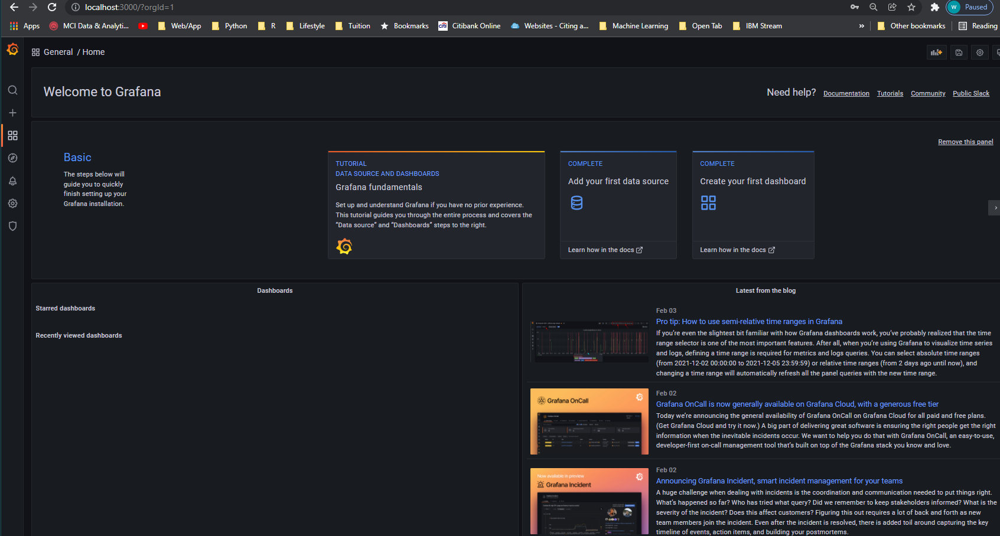
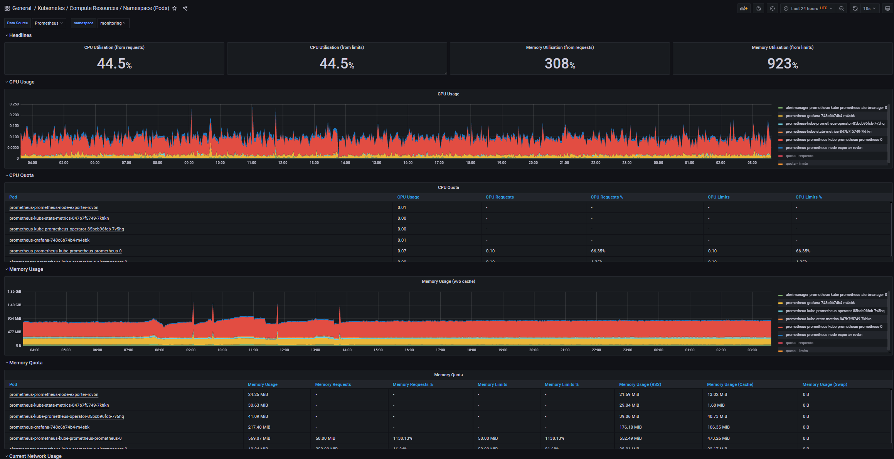
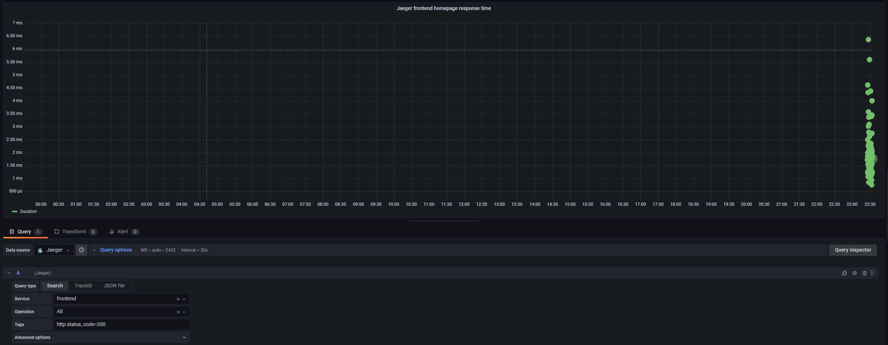
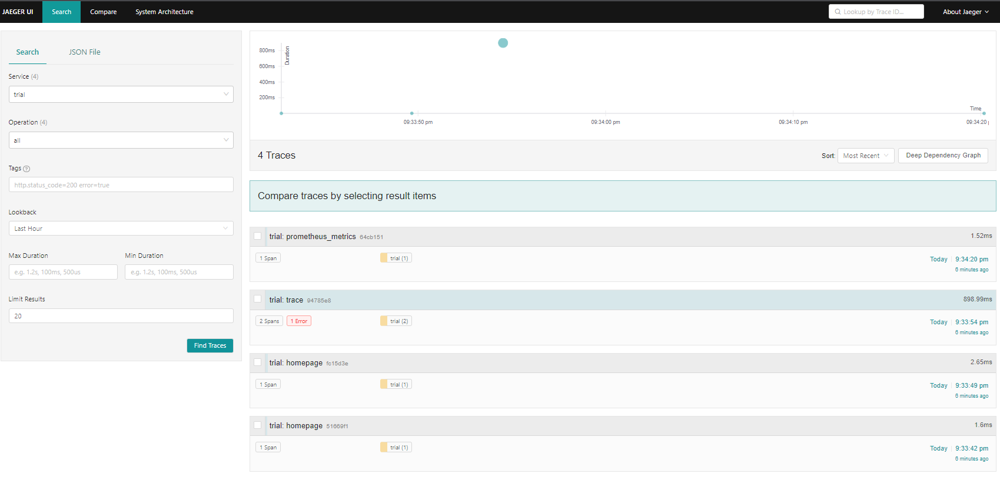
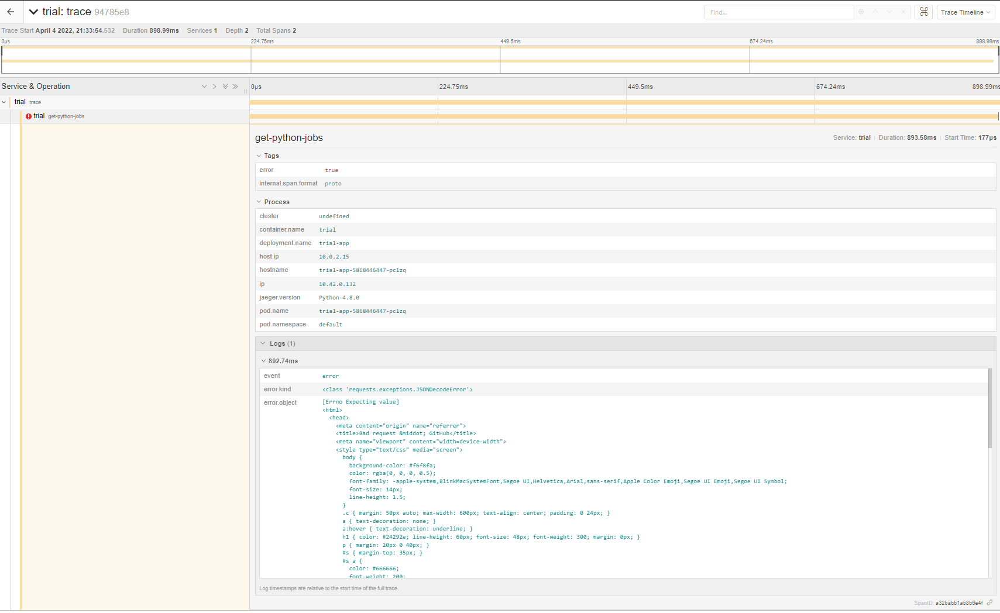
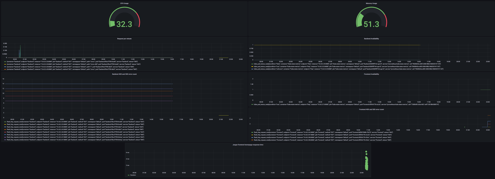

**Note:** For the screenshots, you can store all of your answer images in the `answer-img` directory.

# Issues while setting up for observability project and solution:

*Issue 0* : Kubectl: The connection to the server 127.0.0.1:6443 was refused.

*Solution* :
```
Refer to repo vagrant file for adding port forward 'config.network"forwarded_port",guest: 6443,host: 6443'
```

*Issue 1*: Vagrant was unable to mount VirtualBox shared folders. This is usually because the filesystem "vboxsf" is not available.

*Solution*: 

```
https://stackoverflow.com/questions/43492322/vagrant-was-unable-to-mount-virtualbox-shared-folders
```

*Issue 2*: Error: INSTALLATION FAILED: failed to download "prometheus-community/kube-prometheus-stack"

*Solution* : 
```
Go to vagrant ssh box:
 Step 1  : Install helm chart:
 curl -fsSL -o get_helm.sh https://raw.githubusercontent.com/helm/helm/main/scripts/get-helm-3
 chmod 700 get_helm.sh
 ./get_helm.sh

 Step 2 : install prometheus community
 helm repo add prometheus-community https://prometheus-community.github.io/helm-charts
 helm repo update
 helm install prometheus prometheus-community/kube-prometheus-stack --namespace monitoring --kubeconfig /etc/rancher/k3s/k3s.yaml

 After installation without error:
 Runs 'kubectl get pods -n monitoring' to check all pods should be running.
```

*Issue 3*: error: unable to read URL "https://raw.githubusercontent.com/jaegertracing/jaeger-operator//deploy/crds/jaegertracing.io_jaegers_crd.yaml", server reported 404 Not Found, status code=404

Explaination : this is due to {jaeger_version} wasn't defined.

*Solution* : 
```
export jaeger_version=v1.28.0

kubectl create namespace observability
kubectl create -f https://raw.githubusercontent.com/jaegertracing/jaeger-operator/${jaeger_version}/deploy/crds/jaegertracing.io_jaegers_crd.yaml
kubectl create -n observability -f https://raw.githubusercontent.com/jaegertracing/jaeger-operator/${jaeger_version}/deploy/service_account.yaml
kubectl create -n observability -f https://raw.githubusercontent.com/jaegertracing/jaeger-operator/${jaeger_version}/deploy/role.yaml
kubectl create -n observability -f https://raw.githubusercontent.com/jaegertracing/jaeger-operator/${jaeger_version}/deploy/role_binding.yaml
kubectl create -n observability -f https://raw.githubusercontent.com/jaegertracing/jaeger-operator/${jaeger_version}/deploy/operator.yaml
```

*Issue 4*: Observability - jaeger have no resources

*Solution*:
```
*Note: This setup will take long for deployment to get ready.*
*You can check for the deployment through  'kubectl describe deployment jaeger-operator -n observability'*


There's two line code to help install all jaeger resources
kubectl create namespace observability # <1>
kubectl create -f https://github.com/jaegertracing/jaeger-operator/releases/download/v1.30.0/jaeger-operator.yaml -n observability # <2>

Reference link : https://www.jaegertracing.io/docs/1.30/operator/
```

## Verify the monitoring installation

*TODO:* run `kubectl` command to show the running pods and services for all components. Take a screenshot of the output and include it here to verify the installation


## Setup the Jaeger and Prometheus source
*TODO:* Expose Grafana to the internet and then setup Prometheus as a data source. Provide a screenshot of the home page after logging into Grafana.



## Create a Basic Dashboard
*TODO:* Create a dashboard in Grafana that shows Prometheus as a source. Take a screenshot and include it here.



## Describe SLO/SLI
```
SLO - The end goal of a standard level of performance in a measurable period of time for e.g. 99.5% server uptime in a month
SLI - Measurement on performance specifically this make measuring the objective we set in SLO measurable.  for e.g. number of server error causing unplanned reboot.
```
## Creating SLI metrics.
```
* Error Rate
* Response time
* Availability
* Throughput
* Latency
```

## Create a Dashboard to measure our SLIs
*TODO:* Create a dashboard to measure the uptime of the frontend and backend services We will also want to measure to measure 40x and 50x errors. Create a dashboard that show these values over a 24 hour period and take a screenshot.


## Tracing our Flask App
*TODO:*  We will create a Jaeger span to measure the processes on the backend. Once you fill in the span, provide a screenshot of it here. Also provide a (screenshot) sample Python file containing a trace and span code used to perform Jaeger traces on the backend service.


## Jaeger in Dashboards
*TODO:* Now that the trace is running, let's add the metric to our current Grafana dashboard. Once this is completed, provide a screenshot of it here.



## Report Error
*TODO:* Using the template below, write a trouble ticket for the developers, to explain the errors that you are seeing (400, 500, latency) and to let them know the file that is causing the issue also include a screenshot of the tracer span to demonstrate how we can user a tracer to locate errors easily.

TROUBLE TICKET

Name: Error 500 while trying to visit /trace 

Date: 4th April 2022 , 21:33

Subject: Trial service route /trace showing internal error 500

Affected Area: Trial service

Severity: High Severity

Description: Accessing /trace route in trial service get error 500.




## Creating SLIs and SLOs
*TODO:* We want to create an SLO guaranteeing that our application has a 99.95% uptime per month. Name four SLIs that you would use to measure the success of this SLO.

- Resource consumption - CPU and memory usage
- Service availability - Backend/Frontend availability
- Response error occurence - HTTP 4xx and 5xx status code
- Service reponse - Number of request and Response time 


## Building KPIs for our plan
*TODO*: Now that we have our SLIs and SLOs, create a list of 2-3 KPIs to accurately measure these metrics as well as a description of why those KPIs were chosen. We will make a dashboard for this, but first write them down here.


1. Server CPU and memory usage,ensure sufficient resources is provided to the application to minimize potential issue.
    - Server CPU usage
    - Server Memory Usage

2. Mesure the availability of services to ensure it is accessible to the endpoints access.
    - Measure Backend Availability
    - Measure Frontend Availability

3. Track and measure potential non-sucessful request obtained (any status code that is not 200)
    - Error 4xx mesure
    - Error 5xx mesure
    
4. Services Request and response time averagely needed per request.
    - Total requests per minute
    - Average response


## Final Dashboard
*TODO*: Create a Dashboard containing graphs that capture all the metrics of your KPIs and adequately representing your SLIs and SLOs. Include a screenshot of the dashboard here, and write a text description of what graphs are represented in the dashboard.  


